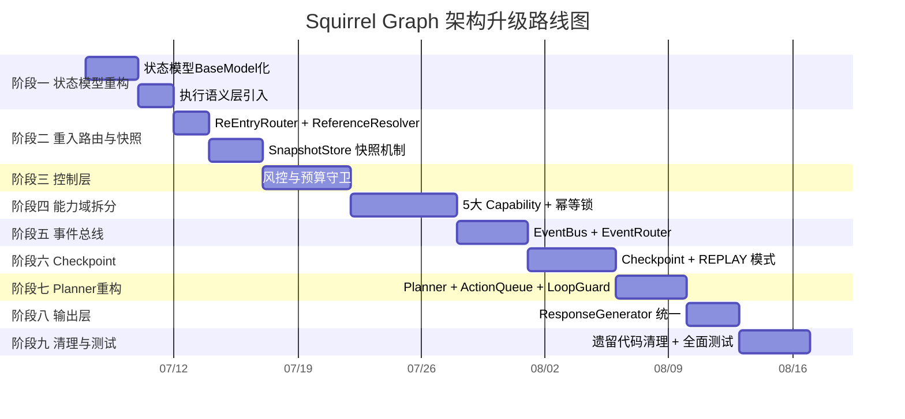

# 实施方案：工业级 LangGraph 架构升级

> 基于 `docs/graph.md` 中定义的顶配版 Graph State 架构，对照当前代码库现状制定分阶段实施计划。
>
> **基线版本**: 当前代码库 (2026-07)
> **目标版本**: 具备执行语义层（NEW/RESUME/SUSPENDED/REPLAY）、幂等锁、事件总线和栈帧快照的工业级架构

---

## 一、现状与目标差距分析

### 1.1 当前架构（As-Is）

```
状态层: ExtendedGraphState (TypedDict, total=False)
  无 execution_mode
  无 graph_version
  无 idempotency_key
  无快照机制

图节点 (7个):
  input_router → intent_classifier → conflict_batch_resolver | query_handler
                                    → confirm_subgraph_handler → mutation_executor
                                                              → post_process → END

控制层: 无独立控制节点，逻辑散落在各节点内部
事件系统: 无，所有副作用在 post_process 中直接执行
执行保障: 无幂等校验，无重入保护
```

### 1.2 目标架构（To-Be）

```
状态层: AgentGraphState (Pydantic BaseModel)
  execution_mode: NEW | RESUME | SUSPENDED | REPLAY
  graph_version: int (单调递增逻辑时钟)
  idempotency_key: str (动作幂等锁)
  SnapshotStoreState (栈帧快照)

图节点 (16+个):
  NormalizeRequest → ReEntryRouter → ReferenceResolver → GoalManager
  → IntentClassifier → LoopGuard → Planner → ActionQueue
  → ParameterResolver → PolicyEngine → PreExecutionChecker
  → BudgetGuard → ConsistencyChecker → CapabilityRouter
  → [5个Capability] → ToolExecutor → ResultValidator
  → StateUpdater → EventBus → EventRouter → Checkpoint
  → TaskEvaluator → ResponseGenerator

控制层: 独立 PreExecutionChecker, BudgetGuard, PolicyEngine
事件系统: EventBus + EventRouter (Topic-based)
执行保障: Idempotency Key + DB Unique Lock + 版本校验
```

---

## 二、分阶段实施计划

### 阶段一：状态模型重构与执行语义层

**目标**: 将 `ExtendedGraphState` TypedDict 升级为 Pydantic BaseModel，引入执行语义层

| 步骤 | 文件 | 改动内容 |
|------|------|----------|
| 1.1 | `models/state.py` | 新增 `ActionStatus` (PENDING/RUNNING/SUCCESS/FAILED) 枚举 |
| 1.2 | `models/state.py` | 新增 `AgentAction` Pydantic Model（含 idempotency_key） |
| 1.3 | `models/state.py` | 新增 `SystemEvent` Pydantic Model |
| 1.4 | `models/state.py` | 新增 `MemoryStoreState`, `WorkspaceStoreState`, `SnapshotStoreState` |
| 1.5 | `models/state.py` | 新增 `AgentGraphState` Pydantic BaseModel（带 execution_mode, graph_version） |
| 1.6 | `models/state.py` | 保留 `ExtendedGraphState` 作为兼容适配层，新增转换函数 |
| 1.7 | `graph.py` | 将 `run_squirrel_graph()` 入口改为接收 `AgentGraphState` |
| 1.8 | `db/sqlite.py` | 新增 `conversation_snapshots` 表，存储挂起快照 |
| 1.9 | `tests/` | 新增状态序列化/反序列化测试，快照持久化测试 |

**耗时预估**: 3-4 天

**风险等级**: 🟡 中 — 需要确保与现有 `TypedDict` 接口的完全向后兼容

---

### 阶段二：ReEntryRouter 与快照恢复机制

**目标**: 实现重入路由网关和栈帧快照生命周期管理

| 步骤 | 文件 | 改动内容 |
|------|------|----------|
| 2.1 | `graph.py` | 新增 `ReEntryRouter` 节点（判定 NEW/RESUME） |
| 2.2 | `graph.py` | 新增 `ReferenceResolver` 节点（指代消解 + 上下文注入） |
| 2.3 | `graph.py` | 新增 `GoalManager` 节点（将 normalized_request 目标化） |
| 2.4 | `graph.py` | 新增 `SnapshotStore` 节点（挂起时封存/恢复时解冻） |
| 2.5 | `graph.py` | 实现 `create_snapshot()` 函数（深拷贝 action_queue + workspace） |
| 2.6 | `graph.py` | 实现 `restore_snapshot()` 函数（解冻快照到当前 state） |
| 2.7 | `graph.py` | 实现 `version_conflict_check()`（比对 graph_version 防漂移） |
| 2.8 | `graph.py` | 重构条件边：`ReEntryRouter → SnapshotStore → WorkspaceStore` (RESUME) |
| 2.9 | `graph.py` | 重构条件边：`ReEntryRouter → ReferenceResolver` (NEW) |
| 2.10 | `ai.py` | 更新 `chat()` 方法传入 `execution_mode` |
| 2.11 | `api/routes.py` | 更新 `_process_chat()` 处理 RESUME 模式恢复 |
| 2.12 | `tests/` | 新增重入路由测试：挂起 → 恢复 → 版本校验 |

**耗时预估**: 4-5 天

**风险等级**: 🟡 中 — 重入逻辑涉及状态机核心语义变更

---

### 阶段三：控制层实现（风控与预算守卫）

**目标**: 构建独立的控制拦截层，将安全逻辑从业务节点中剥离

| 步骤 | 文件 | 改动内容 |
|------|------|----------|
| 3.1 | `graph.py` | 新增 `ParameterResolver` 节点（参数完整性校验 + 缺失检测） |
| 3.2 | `graph.py` | 新增 `PolicyEngine` 节点（策略规则引擎） |
| 3.3 | `graph.py` | 新增 `PreExecutionChecker` 节点（静态拦截 + 风控判定） |
| 3.4 | `graph.py` | 新增 `BudgetGuard` 节点（执行预算控制） |
| 3.5 | `graph.py` | 新增 `ConsistencyChecker` 节点（约束一致性检查） |
| 3.6 | `graph.py` | 新增 `CapabilityRouter` 节点（按 intent 路由到对应 Capability） |
| 3.7 | `models/state.py` | 新增 `PolicyViolation` / `BudgetExceeded` 事件类型 |
| 3.8 | `db/sqlite.py` | 新增 `policy_rules` 表（可配置风控策略） |
| 3.9 | `graph.py` | 重构条件边：`PreExecutionChecker → SnapshotStore` (缺失/高危时挂起) |
| 3.10 | `graph.py` | 重构条件边：`PreExecutionChecker → BudgetGuard` (就绪时放行) |
| 3.11 | `tests/` | 新增控制层各节点单元测试、风控拦截测试 |

**耗时预估**: 4-5 天

**风险等级**: 🟢 低 — 新增节点与现有逻辑正交，不修改原有业务流程

---

### 阶段四：能力域拆分与幂等执行

**目标**: 将现有 Mutation/Query 逻辑拆分为 5 个独立 Capability，植入幂等锁

| 步骤 | 文件 | 改动内容 |
|------|------|----------|
| 4.1 | `services/` | 新建 `capabilities/` 目录 |
| 4.2 | `services/capabilities/__init__.py` | 统一 Capability 注册接口 |
| 4.3 | `services/capabilities/inventory.py` | `InventoryCapability` — 物资入库/出库/扣减 |
| 4.4 | `services/capabilities/expiration.py` | `ExpirationCapability` — 临期查询/预警 |
| 4.5 | `services/capabilities/recommendation.py` | `RecommendationCapability` — 食谱/建议 |
| 4.6 | `services/capabilities/batch.py` | `BatchCapability` — 批量操作 |
| 4.7 | `services/capabilities/household.py` | `HouseholdCapability` — 家庭管理 |
| 4.8 | `graph.py` | 新增 `ToolExecutor` 节点（带 idempotency_key 校验） |
| 4.9 | `graph.py` | 新增 `ResultValidator` 节点（执行结果校验） |
| 4.10 | `graph.py` | 新增 `StateUpdater` 节点（graph_version 递增） |
| 4.11 | `models/state.py` | 扩展 `AgentAction` 支持 capability routing |
| 4.12 | `services/idempotency.py` | 新建幂等锁服务（生成 key + SETNX 校验 + 缓存结果） |
| 4.13 | `db/sqlite.py` | 新增 `idempotency_keys` 表（唯一索引防重） |
| 4.14 | `graph.py` | 重构 CapabilityRouter 条件边路由到 5 个 Capability |
| 4.15 | `tests/` | 新增幂等锁测试、各 Capability 独立测试 |

**耗时预估**: 5-6 天

**风险等级**: 🔴 高 — 核心业务逻辑重构，需确保每个 Capability 行为与现有代码一致

---

### 阶段五：事件总线与精准路由

**目标**: 废除全局广播，实现基于 Topic 的精准事件分发

| 步骤 | 文件 | 改动内容 |
|------|------|----------|
| 5.1 | `services/` | 新建 `services/event_bus.py` |
| 5.2 | `services/event_bus.py` | 实现 `EventBus` 类（事件发布接口、消费者注册） |
| 5.3 | `services/event_bus.py` | 实现 `EventRouter` 类（Topic-based Filter, scope 感知） |
| 5.4 | `models/state.py` | 定义事件类型常量 (InventoryChanged, ThresholdTriggered 等) |
| 5.5 | `graph.py` | 在 StateUpdater 中注入 EventBus 发布调用 |
| 5.6 | `graph.py` | 在 WorkspaceStore/MemoryStore 注册事件消费者 |
| 5.7 | `services/event_bus.py` | 实现 `SubscriptionManager`（细粒度订阅管理） |
| 5.8 | `graph.py` | 将现有 post_process 中的副作用改为事件驱动 |
| 5.9 | `tests/` | 新增事件发布/订阅测试、精准路由测试 |

**耗时预估**: 3-4 天

**风险等级**: 🟡 中 — 事件系统涉及异步通信，需注意幂等性和顺序保证

---

### 阶段六：Checkpoint 与 REPLAY 模式

**目标**: 实现任务检查点和 REPLAY 审计模式

| 步骤 | 文件 | 改动内容 |
|------|------|----------|
| 6.1 | `graph.py` | 新增 `Checkpoint` 节点（执行路径 + state 快照持久化） |
| 6.2 | `graph.py` | 新增 `TaskEvaluator` 节点（动态评估 CONTINUE/DONE/SUSPEND） |
| 6.3 | `db/sqlite.py` | 新增 `checkpoints` 表（检查点持久化） |
| 6.4 | `services/` | 新建 `services/replay.py`（REPLAY 模式执行引擎） |
| 6.5 | `services/replay.py` | 实现基于 Checkpoint 的 replays 回放 |
| 6.6 | `graph.py` | 实现 REPLAY 模式下的 Fast-Forward 逻辑 |
| 6.7 | `graph.py` | 重构图边：`TaskEvaluator → LoopGuard` (CONTINUE 重规划) |
| 6.8 | `graph.py` | 重构图边：`TaskEvaluator → SnapshotStore` (动态拦截) |
| 6.9 | `graph.py` | 重构图边：`TaskEvaluator → ResponseGenerator` (DONE) |
| 6.10 | `tests/` | 新增 Checkpoint 持久化测试、REPLAY 回放测试 |

**耗时预估**: 4-5 天

**风险等级**: 🔴 高 — REPLAY 模式需要 Checkpoint 序列化、幂等重放完备性

---

### 阶段七：Planner 与 Action Queue 重构

**目标**: 将现有意图识别→执行的直接路径改为 Planner→ActionQueue 架构

| 步骤 | 文件 | 改动内容 |
|------|------|----------|
| 7.1 | `graph.py` | 新增 `Planner` 节点（生成 Action + Idempotency Key） |
| 7.2 | `graph.py` | 新增 `ActionQueue` 节点（FIFO 执行队列） |
| 7.3 | `graph.py` | 新增 `LoopGuard` 节点（深度熔断器） |
| 7.4 | `services/` | 新建 `services/planner.py`（规划算法） |
| 7.5 | `services/planner.py` | 实现 `generate_idempotency_key()` 哈希生成 |
| 7.6 | `services/planner.py` | 实现 `plan_actions()` 根据 intent 分解子任务 |
| 7.7 | `graph.py` | 重构条件边：`LoopGuard → Planner` (深度正常) |
| 7.8 | `graph.py` | 重构条件边：`LoopGuard → ResponseGenerator` (熔断) |
| 7.9 | `tests/` | 新增 Planner 规划测试、Action Queue FIFO 测试 |

**耗时预估**: 3-4 天

**风险等级**: 🟡 中 — 与现有 conflict_batch_resolver + mutation_executor 逻辑重叠

---

### 阶段八：ResponseGenerator 与输出层统一

**目标**: 实现纯无状态渲染层，收口所有输出

| 步骤 | 文件 | 改动内容 |
|------|------|----------|
| 8.1 | `graph.py` | 新增 `ResponseGenerator` 节点（纯 UI/文本渲染，无控制流） |
| 8.2 | `graph.py` | 将 `post_process_node` 中的渲染逻辑迁移到 ResponseGenerator |
| 8.3 | `models/state.py` | 标准输出格式：final_response 结构定义 |
| 8.4 | `api/routes.py` | 更新 SSE 输出从取 post_process 结果改为取 ResponseGenerator |
| 8.5 | `graph.py` | 确保所有 END 路径都经过 ResponseGenerator |
| 8.6 | `tests/` | 新增响应格式测试 |

**耗时预估**: 2-3 天

**风险等级**: 🟢 低 — 纯重组，不涉及业务逻辑变更

---

### 阶段九：遗留代码清理与全面测试

**目标**: 移除废弃代码，达到 80%+ 覆盖率

| 步骤 | 文件 | 改动内容 |
|------|------|----------|
| 9.1 | `models/state.py` | 移除 `ExtendedGraphState` 兼容层 |
| 9.2 | `graph.py` | 移除 `extended_to_old_dict()` 适配函数 |
| 9.3 | `services/parser.py` | 迁移 parser 逻辑到对应 Capability |
| 9.4 | `graph.py` | 清理条件边中的冗余分支 |
| 9.5 | `services/conflict_service.py` | 适配新 Capability 架构 |
| 9.6 | `tests/` | 编写缺失的单测（目标覆盖率 >80%） |
| 9.7 | `tests/` | 新增集成测试（完整的 chat 流程覆盖） |
| 9.8 | `tests/` | 新增异常场景测试（网络超时、DB 异常、LLM 超时） |
| 9.9 | `api/routes.py` | 清理不再需要的兼容端点 |

**耗时预估**: 3-4 天

**风险等级**: 🟢 低 — 清理工作，但需确保回归测试通过

---

## 三、实施路线图总览



---

## 四、依赖关系矩阵

| 阶段 | 依赖 | 被依赖 | 能否并行 |
|------|------|--------|----------|
| 一：状态重构 | 无 | 二、三、四、七 | - |
| 二：重入路由 | 一 | 三、六 | ❌ |
| 三：控制层 | 一、二 | 四 | ❌ |
| 四：能力域 | 一、三 | 五、六 | ❌ |
| 五：事件总线 | 四 | 六 | ❌ |
| 六：Checkpoint | 四、五 | 九 | ❌ |
| 七：Planner | 一 | 九 | ✅ （与三/四/五/六并行） |
| 八：输出层 | 一 | 九 | ✅ （与二~七并行） |
| 九：清理测试 | 全部 | 无 | ❌ |

> **并行策略**: 阶段七（Planner）和阶段八（输出层）可以与阶段三~六并行推进，因为它们的代码变更域相对独立。阶段二必须在阶段一之后串行执行，因为状态模型是后续所有阶段的基石。

---

## 五、关键设计决策

### 5.1 向后兼容策略

```
API 层（routes.py） → 适配层（ai.py） → 新引擎（graph.py）
                      ↓
                 旧接口保持（ai_service.chat 签名不变）
```

- 阶段一引入新状态模型时，保留 `ExtendedGraphState → AgentGraphState` 适配转换
- 每个阶段结束时，确保现有测试全部通过（`pytest` 回归）
- 阶段九再一次性移除所有兼容代码

### 5.2 幂等锁实现路径

```
阶段一：内存 Set（简单去重）
阶段四：DB UNIQUE INDEX + SETNX 语义
阶段六：Checkpoint + Idempotency Key 联动校验
```

### 5.3 事件系统引入顺序

```
阶段三：同步事件（pre-execution hooks）
阶段五：异步事件总线（EventBus + EventRouter）
阶段六：事件驱动的 Checkpoint 触发
```

### 5.4 快照序列化策略

```
MemoryStore → JSON → SQLite TEXT 列（阶段二）
MemoryStore → Pickle → SQLite BLOB 列（阶段六，支持复杂对象）
```

---

## 六、测试策略

### 各阶段测试要求

| 阶段 | 单元测试 | 集成测试 | 回归测试 |
|------|----------|----------|----------|
| 一：状态重构 | 状态序列化/反序列化 | - | 全部现有测试 |
| 二：重入路由 | Snapshot CRUD, 版本校验 | 挂起→恢复全流程 | 全部现有测试 |
| 三：控制层 | 各 Guard/Checker 独立测试 | 拦截→挂起→响应 | 全部现有测试 |
| 四：能力域 | 每个 Capability 独立测试 | 幂等锁验证 | 全部现有测试 |
| 五：事件总线 | 发布/订阅/路由 | 事件驱动全链路 | 全部现有测试 |
| 六：Checkpoint | 持久化/回放 | REPLAY 模式 | 全部现有测试 |
| 七：Planner | 规划算法、Key 生成 | - | 全部现有测试 |
| 八：输出层 | 响应格式 | - | 全部现有测试 |
| 九：清理 | - | - | 全面回归 + 80%覆盖 |

### 关键测试场景

```python
# 1. 幂等性测试：相同请求重入两次，只执行一次
def test_idempotency_key_prevents_duplicate_execution():
    ...

# 2. 版本冲突测试：过期快照被拒绝恢复
def test_version_conflict_rejects_stale_snapshot():
    ...

# 3. 事件精准路由测试：InventoryChanged 不通知 MemoryStore
def test_event_router_scope_isolation():
    ...

# 4. REPLAY 模式测试：回放 Checkpoint，结果与原始执行一致
def test_replay_produces_identical_state():
    ...

# 5. 控制层拦截测试：高危操作被 PreExecutionChecker 挂起
def test_pre_execution_checker_suspends_high_risk():
    ...
```

---

## 七、总计工作量

| 阶段 | 预估天数 | 新增文件 | 修改文件 | 风险 |
|------|----------|----------|----------|------|
| 一：状态重构 | 3-4 | 0 | 4-5 | 🟡 |
| 二：重入路由 | 4-5 | 0 | 5-6 | 🟡 |
| 三：控制层 | 4-5 | 0 | 3-4 | 🟢 |
| 四：能力域 | 5-6 | 5-6 | 5-6 | 🔴 |
| 五：事件总线 | 3-4 | 2 | 3-4 | 🟡 |
| 六：Checkpoint | 4-5 | 1 | 4-5 | 🔴 |
| 七：Planner | 3-4 | 1 | 2-3 | 🟡 |
| 八：输出层 | 2-3 | 0 | 2-3 | 🟢 |
| 九：清理测试 | 3-4 | 0 | 5-6 | 🟢 |
| **合计** | **31-40天** | **~10** | **~35** | - |

---

## 八、实施建议

1. **阶段一和阶段二不可跳过**：状态模型和重入路由是新架构的基石，必须先完成
2. **阶段四（能力域拆分）投入最大**：核心业务逻辑重构，建议分配最强资源
3. **阶段七（Planner）可提前与阶段三并行**：Planner 的代码变更域与控制层正交
4. **每阶段结束时运行完整 `pytest`**：确保回归通过再进入下一阶段
5. **阶段四启动前先代码冻结**：避免重构期间业务需求变更增加复杂度
