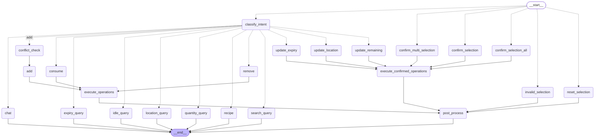

# LangGraph Diagram

```mermaid
---
config:
  flowchart:
    curve: linear
---
graph TD;
	__start__([<p>__start__</p>]):::first
	confirm_selection(confirm_selection)
	confirm_selection_all(confirm_selection_all)
	confirm_multi_selection(confirm_multi_selection)
	reset_selection(reset_selection)
	invalid_selection(invalid_selection)
	execute_operations(execute_operations)
	execute_confirmed_operations(execute_confirmed_operations)
	conflict_check(conflict_check)
	classify_intent(classify_intent)
	add(add)
	consume(consume)
	remove(remove)
	update_location(update_location)
	update_expiry(update_expiry)
	update_remaining(update_remaining)
	expiry_query(expiry_query)
	location_query(location_query)
	search_query(search_query)
	quantity_query(quantity_query)
	idle_query(idle_query)
	recipe(recipe)
	chat(chat)
	post_process(post_process)
	__end__([<p>__end__</p>]):::last
	__start__ -.-> classify_intent;
	__start__ -.-> confirm_multi_selection;
	__start__ -.-> confirm_selection;
	__start__ -.-> confirm_selection_all;
	__start__ -.-> invalid_selection;
	__start__ -.-> reset_selection;
	add --> execute_operations;
	classify_intent -.-> chat;
	classify_intent -. &nbsp;add&nbsp; .-> conflict_check;
	classify_intent -.-> consume;
	classify_intent -.-> expiry_query;
	classify_intent -.-> idle_query;
	classify_intent -.-> location_query;
	classify_intent -.-> quantity_query;
	classify_intent -.-> recipe;
	classify_intent -.-> remove;
	classify_intent -.-> search_query;
	classify_intent -.-> update_expiry;
	classify_intent -.-> update_location;
	classify_intent -.-> update_remaining;
	confirm_multi_selection --> execute_confirmed_operations;
	confirm_selection --> execute_confirmed_operations;
	confirm_selection_all --> execute_confirmed_operations;
	conflict_check --> add;
	consume --> execute_operations;
	execute_confirmed_operations --> post_process;
	execute_operations --> post_process;
	invalid_selection --> post_process;
	remove --> execute_operations;
	reset_selection --> post_process;
	update_expiry --> execute_confirmed_operations;
	update_location --> execute_confirmed_operations;
	update_remaining --> execute_confirmed_operations;
	chat --> __end__;
	expiry_query --> __end__;
	idle_query --> __end__;
	location_query --> __end__;
	post_process --> __end__;
	quantity_query --> __end__;
	recipe --> __end__;
	search_query --> __end__;
	classDef default fill:#f2f0ff,line-height:1.2
	classDef first fill-opacity:0
	classDef last fill:#bfb6fc

```
