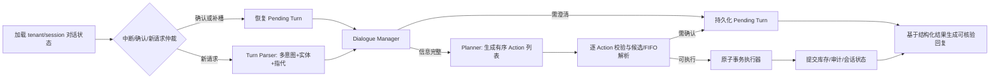

# 50 场景对话测试与 LangGraph 图分析

> 分析日期：2026-07-16  
> 分析对象：`server/tests/test_qa_50_scenarios.py`、`server/tests/qa/qa-test-results.md`、`server/tests/qa/q&a_demo.md`、`server/app/services/graph.py` 及实际接入的 capability 代码。

## 1. 结论摘要

仓库中已经存在由 `test_qa_50_scenarios.py` 生成的结果文件 `server/tests/qa/qa-test-results.md`，生成日期为 2026-07-13，晚于测试文件和 `graph.py` 的最后修改时间。因此本次按要求没有重复执行测试，也没有覆盖当前工作区中已有改动的报告。

报告名义结果为：50 个场景、250 轮对话，通过 62 轮、失败 188 轮，49 个场景存在失败；只有场景 4“模糊计量单位的日常扣减”被统计为 5/5，通过率分别为：

| 场景组 | 名义通过数 | 总轮数 | 名义通过率 |
|---|---:|---:|---:|
| 常规增删改存（1-10） | 19 | 50 | 38.0% |
| FIFO 与保质期（11-20） | 11 | 50 | 22.0% |
| 多意图歧义消除（21-30） | 12 | 50 | 24.0% |
| 多家庭成员协同（31-38） | 9 | 40 | 22.5% |
| 空间拓扑与移动（39-44） | 5 | 30 | 16.7% |
| 中断与异常容错（45-50） | 6 | 30 | 20.0% |
| 合计 | 62 | 250 | 24.8% |

但是，**62/250 不能视为可信的逐轮功能通过率**。报告生成器和测试环境存在系统性失真，实际可确认的结论是：现有系统无法稳定完成测试文档要求的连续、多实体、多动作、有状态家庭物资对话，且主要瓶颈在对话状态模型和实际图拓扑，不只是回复措辞。

## 2. 现有测试结果的可信度

### 2.1 可以采信的信号

- 绝大多数复杂场景在第一轮或很早的轮次就失败，说明基础意图、实体抽取或回复契约已经不能满足场景要求。
- 高频实际回复是“我理解你的意思了……”“没有找到匹配的物品”“参数不完整”等通用兜底，说明系统经常丢失具体物品、位置和动作。
- 空间创建/注销、情感化推荐等场景为 0/5，和代码中缺少相应意图及能力实现一致。
- 入库回复只说“已录入 1 件物品”，不包含物品名、数量和位置；即使底层可能生成了变更，用户也无法核对系统到底理解了什么。

### 2.2 报告生成器导致的失真

1. `_run_turns()` 在任一轮关键词断言失败时立即抛异常，后续轮次没有真正请求接口。
2. `generate_qa_report()` 捕获该场景异常后，把同一条“第 N 轮失败”的异常文本复制成该场景全部 5 轮的实际回复。
3. 随后报告再次在异常文本上检查关键词。异常文本本身会包含 `expected keyword '草莓'`，所以失败轮甚至可能被误记为通过。报告中场景 1 第一轮就是这种假阳性。
4. `_parse_demo_expected()` 没有正确解析 `q&a_demo.md` 的 Markdown 格式，报告的“预期回答”普遍显示“(无预期)”，失去了预期与实际的语义对照。
5. 测试只检查少量关键词是否出现，无法验证数量、单位、目标实例 ID、数据库最终状态、FIFO 批次、是否误改其他物品、确认前是否零写入等关键业务语义。

所以目前的 62 次“通过”同时混有真实通过、异常文本假阳性和非常宽松的关键词命中。

### 2.3 测试隔离问题

- fixture 注释声称每个测试使用“fresh in-memory SQLite DB”，实际 `create_app()` 只调用 `init_db()`，仍使用配置中的持久 SQLite 文件，没有创建或重置内存数据库。
- 报告生成器对 50 个场景复用同一个 `TestClient`，会话消息、conversation state、挂起快照和库存变化可跨场景泄漏。
- `re_entry_router_node`、幂等键和快照都硬编码为 `default_session`，进一步放大场景间、用户间的状态污染。
- API 忽略请求中的 `currentInventory`，总是从 SQLite 读取库存；测试表面传入的库存快照并不能隔离或精确构造前置条件。

在修复测试隔离前，即使重新执行，也只能得到一个“当前共享数据库 + 执行顺序”相关的结果，不能作为稳定回归基线。

## 3. 从人类日常对话看，现有系统的问题

### 3.1 系统只处理“单轮单意图”，日常话语经常是复合任务

测试场景 46 一句话包含入库、删除、查询保质期和生成菜谱四个动作。当前分类器只返回一个 `intent`，规则回退只取 `fallback.operations[0]`，`plan_actions()` 也永远只生成一个 action。所谓 ActionQueue 实际没有承担多动作编排。

影响：用户必须猜系统一次能听懂几个动作；系统可能只做其中一个，却用“处理完毕”让用户误以为全部完成。

### 3.2 上下文记忆只有一个“当前物品”，无法承载真实对话焦点

系统跨轮只保存 `current_context_item` 和 `last_added_item`。它不能表达：

- 同一轮加入的吐司和可乐两个焦点；
- “其中 2 瓶”“剩下的”“旧的那 3 个”等集合、子集和批次指代；
- “那柜子”“另一瓶”“刚才没选的”这类位置或候选集指代；
- 备注、提醒、借出人、所有权、标签等尚未提交的槽位。

更关键的是，`reference_resolver_node` 位于意图分类之前，此时 `extracted_entities` 初始为空。它既没有从原始文本识别代词，也没有重写文本，因此大多数时候只是无效地把空 target 标记为未解析。

### 3.3 澄清不是可继续的对话，只是一次性报错

`parameter_resolver_node` 在缺参数时返回“请补充完整后重试”，但没有保存结构化的“正在完成哪个目标、已经有哪些参数、下一轮只需补什么”。用户自然回答“蛋格”“三天后”“第二个”时，系统往往会把它当成一个全新请求。

真实对话需要 slot filling：保留原 intent、已有实体、缺失槽位、候选项和来源轮次，并允许用户补充、修正或中断。

### 3.4 多候选、FIFO 和确认能力写了但没有接入实际图

`conflict_batch_resolver_node` 实现了三层匹配、候选列表、临期排序、FIFO 批次锁定和 PendingOperation，但 `build_squirrel_graph()` 没有 `add_node()`，也没有任何边指向它。

实际 mutation 路径是 `capability_router -> loop_guard -> planner -> action_queue -> tool_executor`。InventoryCapability 对消费只精确匹配第一个同名物品，对移除在没有 pending/confirmed ID 时甚至可能生成 0 条变更，却仍回复“已移除 0 件物品”。因此测试文档最核心的批次选择和多候选流程在生产拓扑中并不存在。

### 3.5 查询结果不符合人类提问的范围和聚合方式

- 数量查询只返回第一个精确同名实例，不会聚合全屋同 SKU、相似 SKU或不同位置批次。
- 保质期查询忽略用户指定的目标，统一列出所有 danger 物品；问“这瓶还能放几天”不一定得到这瓶的日期差。
- 位置查询只取第一个候选，无法回答“柜子里还有什么”“冷藏层还有别的生鲜”。
- 搜索主要依赖字面命中，不能可靠处理“快乐源泉”“饮料”“能做饼的”“别的牌子的鲜奶”等类别、属性或常识检索。
- 菜谱虽然要求一个 target 才执行，真正生成时却使用全局临期食材列表，目标约束没有落实。

### 3.6 回复不可核验，也缺少对话常识

变更回复经常不包含目标、旧值、新值、位置、数量或是否待确认。对“打碎油瓶”缺少先确认人身安全，对情绪化求助缺少共情和适度健康提醒，对天气等临时话题缺少自然中断后恢复原任务的能力。

日常家庭助手应优先做到：先回应人的处境，再明确“我理解成什么、准备改什么、是否已经改了”。当前回复层更像接口状态提示。

### 3.7 测试文档要求的多个领域目前没有数据模型或 capability

包括采购清单、提醒、备注/标签、开封状态与 PAO、借用归还、成员所有权和隐私、空间节点创建/重命名/注销、操作历史追溯、撤销/回滚、预算/成本。这些需求不能靠增加意图关键词完成，需要明确领域模型、持久化和工具能力。

## 4. 实际 LangGraph 拓扑的问题

### 4.1 文档、代码注释和真实拓扑不一致

`graph.py` 文件头仍写“6 节点简洁拓扑”，实际构建了约 25 个节点；`docs/tests/Q&A.md` 的预期路径包含 `conflict_batch_resolver`，真实图却未接入；`docs/graph.md` 描述 NormalizeRequest、MemoryStore、WorkspaceStore、EventRouter 和多个能力节点，代码中这些并非实际 LangGraph 节点。

这会导致评审和测试按一张图理解，运行时却走另一张图。

### 4.2 Re-entry/快照恢复路径逻辑错误

当前路径是：

```text
START -> re_entry_router
  new    -> reference_resolver -> ...
  resume -> snapshot_store -> response_generator -> END
```

发现活跃快照后，`re_entry_router_node` 只把快照内容塞进 `extracted_entities`；没有恢复 `interaction_mode`、`pending_operation`、action queue 等真实 state 字段。随后又进入 `snapshot_store_node`，不会合并当前用户输入、不会进入确认处理器，也不会继续原 action。快照也没有在成功、取消或过期恢复时被消费/关闭。

结果是一次缺参、无效操作或确认挂起可能让同一 `default_session` 的后续请求反复走“恢复后直接输出”，形成会话毒化。

### 4.3 会话作用域是全局常量，不是用户/家庭/会话

快照、planner、幂等键、checkpoint 都使用 `default_session`。`conversation_state` 也是固定 `id = 1`。测试中的“老公/老婆”只是显示名，不构成隔离边界。

这不仅影响测试可靠性，也意味着不同浏览器、家庭成员或并发请求可能共享挂起选择和指代上下文，存在误操作风险。

### 4.4 图中存在两套重叠执行架构

一套是遗留的 `conflict_batch_resolver -> confirm_subgraph_handler -> mutation_executor`，另一套是新建的 `planner -> tool_executor -> capability`。实际图只接了遗留确认处理器和 mutation executor 的一部分，但新请求的 mutation 又绕过 conflict resolver 直接走 capability。

重复实现已经出现语义分叉，例如：

- resolver 支持三层模糊匹配，InventoryCapability 基本只做精确匹配；
- resolver 支持 FIFO、多选，capability 默认取第一个；
- mutation executor 和 InventoryCapability 都能生成 mutation logs；
- query handler 与各 query capability 重复实现查询，实际 query 路径又绕过 ToolExecutor 直接去 query handler。

维护者修复其中一套，不一定影响真实运行路径。

### 4.5 Planner、ActionQueue 和 TaskEvaluator 目前是形式节点

- planner 对任何 intent 只创建一个 action；
- action_queue 在 planner 已设置 `current_action` 后不会真正出队，也没有在执行后清空 current action；
- task_evaluator 从不返回 CONTINUE；
- 因而 loop guard 的重规划循环在正常逻辑中不可达，多动作和部分成功恢复也不存在。

复杂拓扑增加了状态面，却没有提供对应能力。

### 4.6 快照、幂等和版本号没有形成闭环

- 每次 `run_squirrel_graph()` 都重新构造 state，没有注入持久化 graph version；版本通常从 0 重新开始。
- 幂等键由固定 session、graph version、tool name 和少量参数生成；不同真实请求可能碰撞，同一请求的完整实体变化又未必进入 key。
- checkpoint 只保存摘要和回复预览，无法真正 replay 一次事务。
- snapshot 固定写 graph version 1，也没有 compare-and-swap 消费流程。
- `version_conflict_check` 等导入没有用于实际执行路径。

因此当前机制有“工业级”名词，但还没有提供可靠的并发安全、恢复或回放语义。

### 4.7 控制节点存在无效或不恰当规则

- consistency checker 中 `intent == "update_location" and intent == "update_expiry"` 永远不可能成立。
- 同一次操作同时更新位置和保质期被一律视为冲突，但日常对话中“把牛奶放冰箱，保质期到周五”是合法的复合更新。
- policy 中“批量删除”规则缺少 conditions，实际不会触发。
- pre-execution checker 只用 `item.title == target`，与前面宣称的三层匹配不一致。
- 参数缺失、策略阻断、无效操作和预算超限全部进入 snapshot，连不可恢复错误也会制造活跃挂起状态。

## 5. 建议的目标图

建议先收敛为一条可验证的主链，而不是继续增加旁路节点：



核心原则：

1. 对话挂起使用 `PendingTurn`，执行恢复使用 `ExecutionCheckpoint`，不要混用。
2. session key 至少由 household/tenant、conversation、user 组成，不得硬编码全局 session。
3. Parser 输出 `intents/actions[]`，每个动作有自己的实体、来源文本和依赖关系。
4. 候选消歧和 FIFO 是 inventory domain resolver 的唯一实现，planner、确认和 executor 都复用它。
5. 所有变更先形成结构化 proposed operations；需要确认时零写入，确认后在一个事务中物化并写审计。
6. ResponseGenerator 只消费结构化执行结果，必须明确目标、数量、位置、状态及“已执行/待确认/未执行”。

## 6. 修复优先级

### P0：先恢复正确性与可测性

1. 修复测试报告生成器：每轮独立记录请求结果与断言，异常不得复制到未执行轮次，异常文本不得参与关键词通过判定。
2. 为每个场景创建独立临时 SQLite，显式 seed 前置状态并清空 conversation state、snapshots、pending confirmations、idempotency 和 checkpoints。
3. 使用真实 session ID；移除所有 `default_session` 和 conversation state `id=1` 的全局共享。
4. 决定唯一 mutation 主链：要么把 conflict resolver 正确接入，要么把其全部语义迁移到唯一 InventoryCapability，然后删除遗留重复实现。
5. 修复 snapshot resume：恢复结构化 pending state、处理本轮输入、成功/取消后原子消费快照；不可恢复错误不得创建活跃快照。
6. 对变更测试数据库最终状态和目标 item ID，而不只测试回复关键词。

### P1：补齐日常多轮对话基础

1. 引入 PendingTurn/slot filling，支持补参数、纠正、否定、换目标、取消和临时插问后恢复。
2. 把上下文从单个 item 扩展为 focus stack + entity sets + location focus + candidate set。
3. 支持一轮多个 action，并定义部分失败、依赖顺序、确认边界和原子性。
4. 统一查询语义：数量聚合、位置范围查询、目标保质期、类别/属性检索。
5. 回复中稳定包含用户可核验的业务字段。

### P2：按领域逐项实现测试文档能力

采购清单与提醒、备注/标签、开封生命周期、借用归还、家庭协同与权限、空间拓扑 CRUD、审计/撤销、成本预算和情绪化交互应分别建模并拥有 capability 与验收测试。未实现前应明确答复“当前不支持”，避免假装操作成功。

## 7. 建议的验收指标

- 基础层：单轮 intent/entity 准确率，且变更回复字段完整率 100%。
- 状态层：确认前数据库零变化；取消后 pending 清空；跨 session 无状态泄漏。
- 事务层：FIFO 必须断言目标 instance ID；复合操作断言 action 顺序和最终数据库状态。
- 对话层：每个场景逐轮独立计分，同时记录“回复语义、状态转换、数据库变化”三类结果。
- 回归门槛：先让 50 个场景都能完整跑完 5 轮且无框架异常，再讨论关键词或语义通过率。

## 8. 本次未执行的操作

本次没有重新运行 `test_qa_50_scenarios.py`，原因是仓库已存在目标测试生成的结果，符合“若没有结果才执行”的条件；同时该报告在当前工作区已有未提交修改，直接重跑生成器会覆盖用户现有内容。分析基于现有报告、测试代码、预期对话文档和实际图/能力实现完成。
